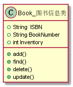

# 实验三：图书管理系统领域对象建模

|学号|班级|姓名|
|:----:|:----:|:----:|
|201510414112|15级软工一班|黄照伟|

# 1.图书管理系统类图
### 1.1类图源码：
```
@startuml

class 读者{
    -ID:String
    -name:String  
    -sex:String
    -role:String 
    -number:Interger
}
class 注册用户{
    -ID:String
    -name:String  
    -sex:String
    -role:String 
    -number:Interger
}
class 会员{
    -name:String 
    -age:Interger
    -maxBorrowNum:Interger
    -maxBorrowDays:date
    -roletime:date
}
class 预定的记录{
    -booktime:date
    +add()
    +select()
}
class 借书记录{
    -lendtime:date
    -returntime:date
    +add()
    +select()
}
class 逾期记录{
    -continueday:date
    -lastday:date
    -returntime:date
    +add()
    +select()
}
class 超级管理员{
    -mangerId:Interger
    -mangerName:String
    -mangerNumber:String
    -mangerAddress:String
    -mangerPhone:String
    +add()
    +select()
    +delete()
    +update()
}
class 管理员信息{
    -mangerId:Interger
    -mangerName:String
    -mangerNumber:String
    -mangerAddress:String
    -mangerPhone:String
    +add()
    +select()
    +delete()
    +update()
}
class 读者信息{
    -readerId:Interger 
    -readerName:String 
    -bookISBN:String 
    -lendBookTime:String 
    -returnBookTime:String
    +select()
    +borrow()
    +xujie()
    +yujie()
    +returnBook()
    +findBook()
}
class 图书信息{
    -bookId:Interger
    - bookISBN:String
    -bookName:String 
    -total:Interger 
    -stock:Interger 
    -publisher:String 
    -author:String 
    -summary:String
    +add()
    +select()
    +delete()
    +update()
    +setStatus()
}

读者信息 "多" --* "1" 预定的记录  :借阅
读者信息 --> 借书记录:添加
借书记录 --> 管理员信息:增加借阅信息
借书记录 --> 逾期记录
逾期记录 --> 管理员信息:处理
预定的记录 --> 管理员信息 :增加预定记录
管理员信息 "1" --* "多" 图书信息 :mange
管理员信息 "1" --* "多" 读者信息  :mange
超级管理员 "1" -- "多"管理员信息:contains
读者信息    <|--    读者
读者信息    <|--    注册用户
读者信息    <|--    会员

@enduml

```
### 1.2类图


### 类图说明

读者信息有包含了三个种类分别有对应的等级
借书记录、预订记录、逾期记录描述是图书信息类的一部分
读者和管理员、超级管理员可以对图书信息类、预借信息类、借阅信息类进行操作但是操作的权限不同
比如：普通管理员只能对BookInfo进行select操作，但是超级管理员能对其进行更多的删改添加操作

## 2. 图书管理系统的对象图
### 2.1 图书信息类的对象图
#### 源码如下：
``` class
@startuml
class Book_图书信息类{
        +String  ISBN
        +String BookNumber
        +int Inventory
        +add()
        +find()
        +delete()
        +update()
}
@enduml
``` 
#### 对象图如下：


#### 说明：
``` 
图书信息类：
    属性：
        ISBN：书号
        BookNumber：图书编号
        Inventory：库存
    方法：
        add()：添加图书
        find()：查找图书
        delete()：删除图书
        update()：更新图书
``` 

### 2.2 借阅者类的对象图
#### 源码如下：
``` class
class Reader_借阅者{
    +String  ID
    +String  name
    +int  maxBorrowNum
    +int  maxBorrowDays 
    +int  borrowNum
    +find()
    +borrow()
    +returnDate()
}
``` 
#### 对象图如下：


#### 说明：
``` 
借阅者类：
    属性：
        ID：借阅者号
        name：借阅者姓名
        maxBorrowNum：最大借书量
        maxBorrowDays：最大借书时限
        borrowNum：借书数量
    方法：
        find()：查找图书
        returnDate()：还书日期
        borrow()：借书
``` 

### 2.3 借阅信息类的对象图
#### 源码如下：
``` class
@startuml
class Borrow_借阅信息类{
    +String  ISBN
    +String  readerId
    +boolean  isOvertime
    +Date  lendDate
    +Date  returnDate
    +add()
    +delete()
    +update()
    +find()
    +save()
}
@enduml
``` 
#### 对象图如下：


#### 说明：
``` 
借阅信息类：
    属性：
        ISBN：书号
        readerId：借阅者号
        isOvertime：是否超出时限
        lendDate：借书日期
        returnDate：还书日期
    方法：
        add()：添加图书
        find()：查找图书
        delete()：删除图书
        update()：更新图书
        save()：保存操作
``` 

### 2.4 图书管理员类的对象图
#### 源码如下：
``` class
@startuml
class admin_图书管理员{
    String adminID
    String adminName
    +add()
    +find()
    +update()
    +delete
    +payFine()
}
@enduml
``` 
#### 对象图如下：


#### 说明：
``` 
图书管理员类：
    属性：
        adminID：图书管理员编号
        adminName：图书管理员姓名
    方法：
        add()：添加图书
        find()：查找图书
        delete()：删除图书
        update()：更新图书
        payFine()：罚金缴纳
``` 

### 2.5 图书描述类的对象图
#### 源码如下：
``` class
@startuml
class BookDescribeInfo_图书描述{
    +String ISBN
    +String bookName
    +String bookType
    +String describe
    +double price
    +String author
    +String bookVersion
}
@enduml
``` 
#### 对象图如下：


#### 说明：
``` 
图书描述类：
    属性：
        ISBN：书号
        bookName：图书名称
        bookType：图书类型
        bookVersion：图书版本
        describe：图书描述
        price：价格
        author：作者
``` 
