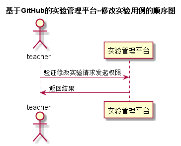

# “修改实验”用例 [返回](../README.md)
## 1. 用例规约

|用例名称|修改实验|
|-------|:-------------|
|功能|老师修改已发布的实验|
|参与者|老师|
|前置条件|老师需登录，实验已发布|
|后置条件| |
|主事件流| |
|备选事件流| |

## 2. 业务流程（顺序图） [源码](../src/修改实验.puml)
 
 
## 3. 界面设计
- 界面参照:https://huangzhaowei123.github.io/is_analysis/test6/ui/修改实验.html
- API接口调用
    - 接口1：[changeTest](../jiekou/changeTest.md) 

## 4. 算法描述
    无
    
## 5. 参照表
- [TEACHERS](../数据库设计.md/#STUDENTS)
- [TESTS](../数据库设计.md/#TESTS)

