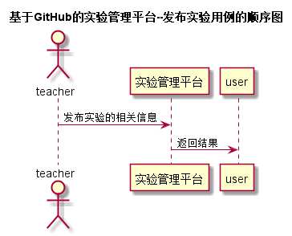

# “发布实验”用例 [返回](../README.md)
## 1. 用例规约

|用例名称|发布实验|
|-------|:-------------|
|功能|老师发布一个新的实验|
|参与者|老师|
|前置条件|老师需登录|
|后置条件| |
|主事件流| |
|备选事件流| |

## 2. 业务流程 [源码](../src/发布实验.puml)
 
 
## 3. 界面设计
- 界面参照: https://huangzhaowei123.github.io/is_analysis/test6/ui/发布实验.html
- API接口调用
    - 接口1：[getTest](../jiekou/getTest.md) 

## 4. 算法描述
    无
    
## 5. 参照表
- [TEACHERS](../数据库设计.md/#STUDENTS)
- [TESTS](../数据库设计.md/#TESTS)

